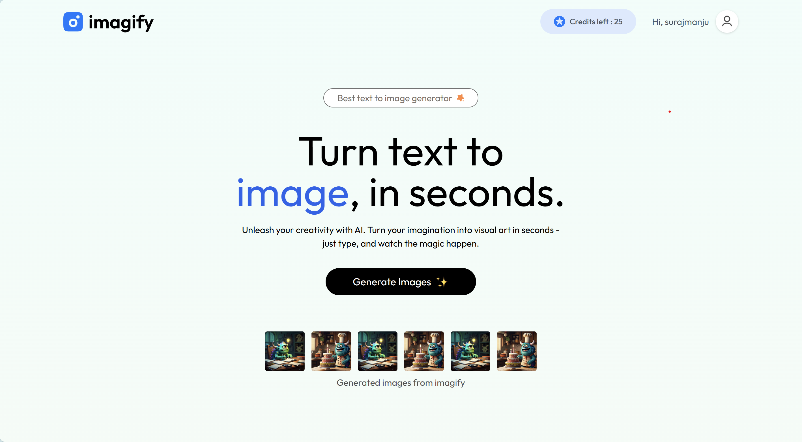
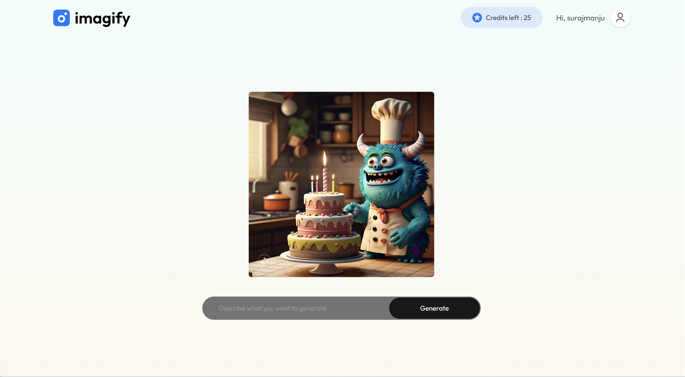
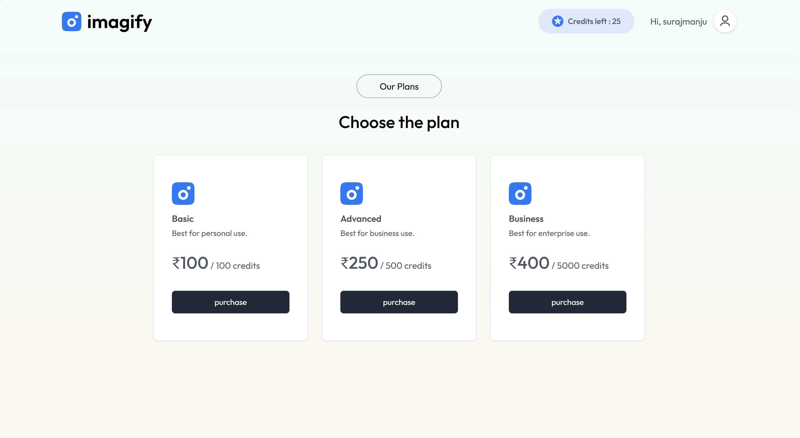
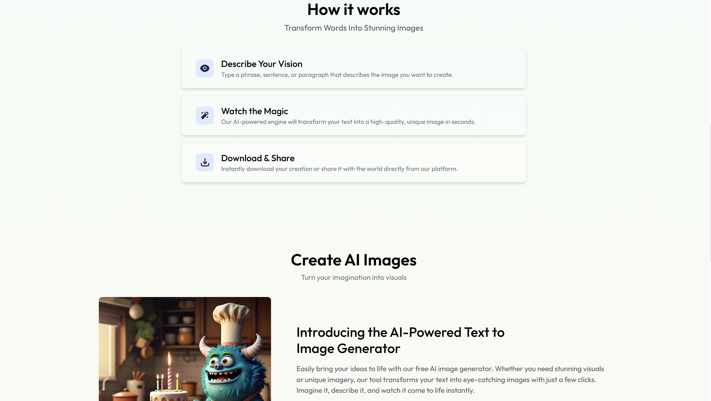

📸 Imagify — AI Text-to-Image Generator SaaS

A full-stack MERN + Vite application that converts text prompts into high-quality AI images using the ClipDrop API, featuring JWT authentication, a credit-based system, and Razorpay payment integration.

🖼 Project Screenshots

(Add your screenshots here)

  
 
  
 
  

  

⭐ Project Overview (STAR Approach)
⭐ Project Overview (STAR Approach)
Situation

Generating high-quality visuals quickly is still challenging and expensive. Many AI tools lack smooth UX, affordable credits, or a beginner-friendly workflow. Imagify was created to solve this by providing a clean, secure, credit-based AI image generator.

Task

Build a scalable SaaS application where users can:

Register and log in securely

Generate AI images using text prompts

Use 5 free credits on signup

Purchase extra credits via Razorpay

View and store transaction details

Enjoy smooth animations and notifications

Action
🔐 Authentication

Implemented JWT-based login/signup

Added route protection middleware (auth.js)

🗄 Backend (Express + MongoDB)

Set up mongodb.js for database connection

Created models: usermodel.js & transactionModel.js

Added controllers: userController.js, imageController.js

Organized API routes in userRoutes.js and imageRoutes.js

🤖 AI Image Generation

Integrated ClipDrop Image Generation API

Added credit deduction logic (1 credit per image)

💳 Razorpay Payment Integration

Added 3 prepaid credit plans

Created/verified orders securely

Stored transactions in MongoDB

🎨 Frontend (React + Vite)

Built the UI using React with Vite bundler for fast development

Added Framer Motion for animations

Added React-Toastify for messages

Organized UI into assets, components, context, and pages folders

Result

Imagify now delivers:

Fast text-to-image transformations

Reliable JWT auth & state management

Razorpay-powered transactions

Smooth UI animations & feedback

Scalable backend & modular codebase

This showcases full-stack SaaS development, API usage, payment workflows, and production-level architecture.

🚀 Features
⭐ Core

AI image generation using ClipDrop

JWT-secured authentication

Credit-based system

⭐ Payments

Razorpay integration

3 credit purchase plans

Transaction logging

⭐ Frontend

React + Vite for fast builds

Framer Motion animations

React-Toastify alerts

⭐ Backend

Express.js REST APIs

Modular MVC architecture

Environment-based configuration

🛠 Tech Stack
Frontend

React

Vite

Framer Motion

React Toastify

Backend

Node.js

Express.js

JWT Auth

Razorpay API

ClipDrop API

Database

MongoDB + Mongoose

📥 Installation & Setup
1️⃣ Clone the repo
git clone https://github.com/yourusername/imagify.git
cd imagify

📦 Frontend Setup (React + Vite)
cd client
npm install
npm run dev

Client .env
VITE_BACKEND_URL=http://localhost:5000
VITE_RAZORPAY_KEY_ID=your_key_id

🔧 Backend Setup (Node + Express)
cd server
npm install
npm run server

Server .env
MONGO_URI=your_connection_string
JWT_SECRET=your_jwt_secret
CLIPDROP_API_KEY=your_clipdrop_api_key

RAZORPAY_KEY_ID=your_key_id
RAZORPAY_KEY_SECRET=your_key_secret

📚 Folder Structure
Client (Frontend — React + Vite)
client/
│
├── index.html
├── .env
│
└── src/
    ├── assets/
    ├── components/
    ├── context/
    ├── pages/
    ├── App.jsx
    ├── main.jsx
    └── index.css

Server (Backend — Node + Express)
server/
│
├── server.js
├── .env
│
├── config/
│   └── mongodb.js
│
├── controllers/
│   ├── imageController.js
│   └── userController.js
│
├── middlewares/
│   └── auth.js
│
├── models/
│   ├── transactionModel.js
│   └── usermodel.js
│
└── routes/
    ├── imageRoutes.js
    └── userRoutes.js

📌 API Overview
User API
Method	Route	Description
POST	/api/user/register	Create a new user
POST	/api/user/login	Authenticate user
AI Image API
Method	Route	Description
POST	/api/image/generate	Generate AI image (protected)
Payment API
Method	Route	Description
POST	/api/user/create-order	Razorpay order creation
POST	/api/user/verify-payment	Payment verification
🙌 Contributing

Contributions, issues, and feature requests are welcome!

📝 License

MIT License © 2025 Imagify
